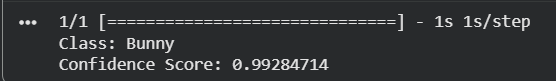

# Image Recognition using Google Teachable Machine

A simple image recognition project developed using **Google Teachable Machine** and **TensorFlow Keras**. The project trains a custom image classification model and uses a Python script to predict the class of an input image.

---

## Project Overview

This project demonstrates the basic workflow of creating an image recognition model without writing machine learning code. The model was trained using Google Teachable Machine, exported in TensorFlow Keras format, and integrated into a Python application for image classification.

---

## Features

- Train a custom image classification model
- Export the trained model in TensorFlow Keras format
- Load the model using Python
- Predict the class of an input image
- Display the prediction result with confidence score


---

## Project Structure

```
Image-Recognition-Model/
│
├── ImageRecognitionModel.py          # Python prediction script
├── keras_model.h5                    # Trained model
├── labels.txt                        # Class labels
├── test.jpg                          # Sample input image
├── output.png                        # Prediction screenshot
└── README.md                         # Project documentation
```

---

## How the Project Works

1. Collect images for each class.
2. Train the model using Google Teachable Machine.
3. Export the model in **TensorFlow → Keras** format.
4. Load the model in Python.
5. Input an image.
6. The model predicts the image class and confidence score.

---

## How to Run

### 1. Install the required library

```bash
pip install tensorflow
```

### 2. Place your image

Save the image you want to classify in the project folder.

### 3. Run the script

```bash
python ImageRecognitionModel.py
```

---

## Example Output

```
Prediction: Class 1
Confidence: 98.4%
```

---

## Files Description

| File | Description |
|------|-------------|
| `predict.py` | Loads the model and predicts the image class |
| `keras_model.h5` | Exported TensorFlow Keras model |
| `labels.txt` | Contains the class names |
| `test.jpg` | Sample image used for testing |
| `output.png` | Screenshot of the prediction result |

---

## Screenshots



---

## Conclusion

This project provides a simple implementation of image recognition using Google Teachable Machine and TensorFlow Keras. It demonstrates the complete process from training a model to making predictions with Python, making it suitable for beginners who want to learn the fundamentals of image classification.

---
